## Manipulation of relevant input features
* ### LocCNN
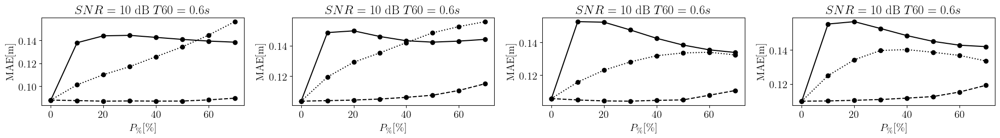
* ### SampleCNN
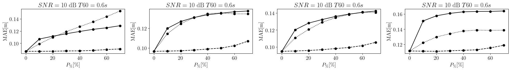

## Feature Inspection

In the following, for each environmental condition considered we will report feature results related to the best and worst performing sources for both LocCNN and SampleCNN

## T60 0.15 s SNR 25 dB

#### SampleCNN
* #### Best performing
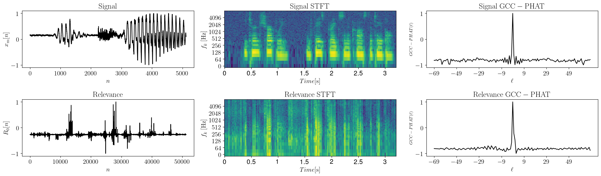

Microphone audio signal
<audio controls>
<source src="figures/audio_microphone_sample_cnn_SNR_25_T60_0.15_error_min.wav">
Your browser does not support the audio element.
</audio>

Relevance audio signal
<audio controls>
<source src="figures/audio_relevance_sample_cnn_SNR_25_T60_0.15_error_min.wav" type="audio/mpeg">
Your browser does not support the audio element.
</audio>

* #### Worst performing
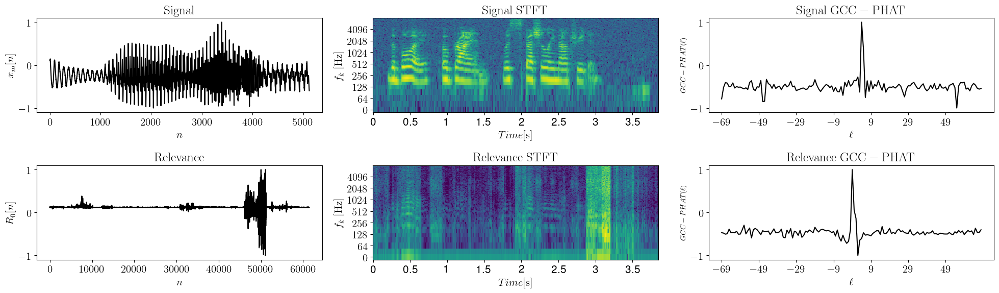
  
Microphone audio signal
<audio controls>
<source src="figures/audio_microphone_sample_cnn_SNR_25_T60_0.15_error_max.wav">
Your browser does not support the audio element.
</audio>

Relevance audio signal
<audio controls>
<source src="figures/audio_relevance_sample_cnn_SNR_25_T60_0.15_error_max.wav" type="audio/mpeg">
Your browser does not support the audio element.
</audio>

#### LocCNN
* #### Best performing
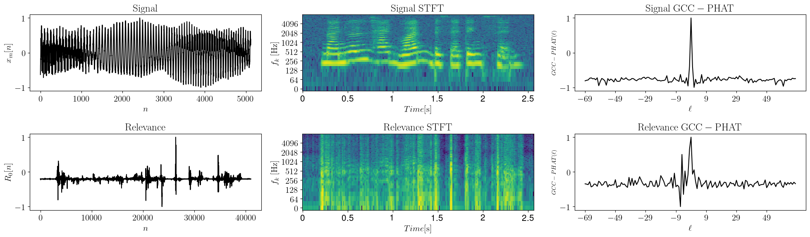

Microphone audio signal
<audio controls>
<source src="figures/audio_microphone_loc_cnn_SNR_25_T60_0.15_error_min.wav">
Your browser does not support the audio element.
</audio>

Relevance audio signal
<audio controls>
<source src="figures/audio_relevance_loc_cnn_SNR_25_T60_0.15_error_min.wav" type="audio/mpeg">
Your browser does not support the audio element.
</audio>

* #### Worst performing
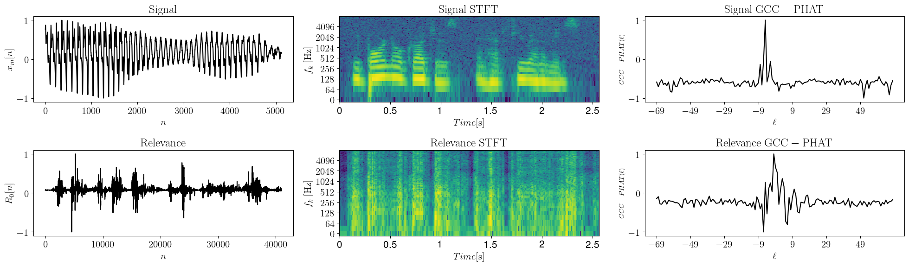
  
Microphone audio signal
<audio controls>
<source src="figures/audio_microphone_loc_cnn_SNR_25_T60_0.15_error_max.wav">
Your browser does not support the audio element.
</audio>

Relevance audio signal
<audio controls>
<source src="figures/audio_relevance_loc_cnn_SNR_25_T60_0.15_error_max.wav" type="audio/mpeg">
Your browser does not support the audio element.
</audio>

## T60 0.3 s SNR 20 dB

#### SampleCNN
* #### Best performing
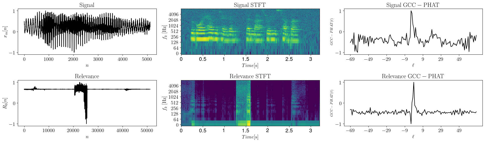

Microphone audio signal
<audio controls>
<source src="figures/audio_microphone_sample_cnn_SNR_20_T60_0.3_error_min.wav">
Your browser does not support the audio element.
</audio>

Relevance audio signal
<audio controls>
<source src="figures/audio_relevance_sample_cnn_SNR_20_T60_0.3_error_min.wav" type="audio/mpeg">
Your browser does not support the audio element.
</audio>

* #### Worst performing
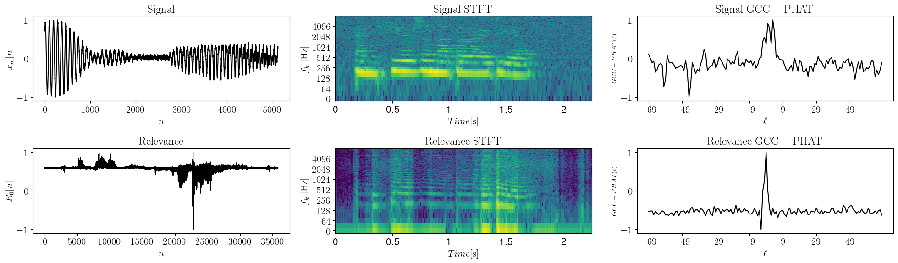
  
Microphone audio signal
<audio controls>
<source src="figures/audio_microphone_sample_cnn_SNR_20_T60_0.3_error_max.wav">
Your browser does not support the audio element.
</audio>

Relevance audio signal
<audio controls>
<source src="figures/audio_relevance_sample_cnn_SNR_20_T60_0.3_error_max.wav" type="audio/mpeg">
Your browser does not support the audio element.
</audio>

#### LocCNN
* #### Best performing
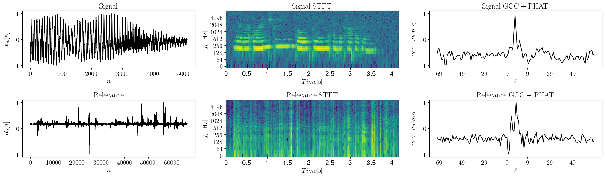

Microphone audio signal
<audio controls>
<source src="figures/audio_microphone_loc_cnn_SNR_20_T60_0.3_error_min.wav">
Your browser does not support the audio element.
</audio>

Relevance audio signal
<audio controls>
<source src="figures/audio_relevance_loc_cnn_SNR_20_T60_0.3_error_min.wav" type="audio/mpeg">
Your browser does not support the audio element.
</audio>

* #### Worst performing
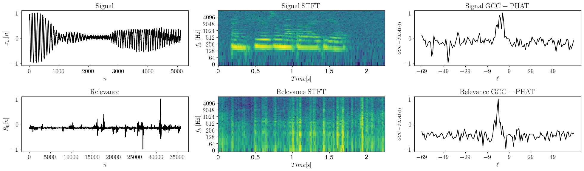
  
Microphone audio signal
<audio controls>
<source src="figures/audio_microphone_loc_cnn_SNR_20_T60_0.3_error_max.wav">
Your browser does not support the audio element.
</audio>

Relevance audio signal
<audio controls>
<source src="figures/audio_relevance_loc_cnn_SNR_20_T60_0.3_error_max.wav" type="audio/mpeg">
Your browser does not support the audio element.
</audio>

## T60 0.4 s SNR 15 dB

#### SampleCNN
* #### Best performing
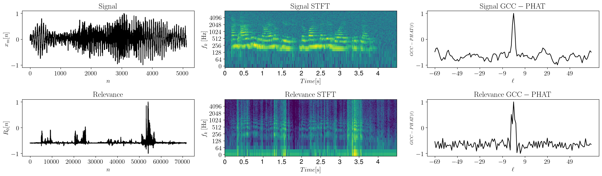

Microphone audio signal
<audio controls>
<source src="figures/audio_microphone_sample_cnn_SNR_15_T60_0.4_error_min.wav">
Your browser does not support the audio element.
</audio>

Relevance audio signal
<audio controls>
<source src="figures/audio_relevance_sample_cnn_SNR_15_T60_0.4_error_min.wav" type="audio/mpeg">
Your browser does not support the audio element.
</audio>

* #### Worst performing
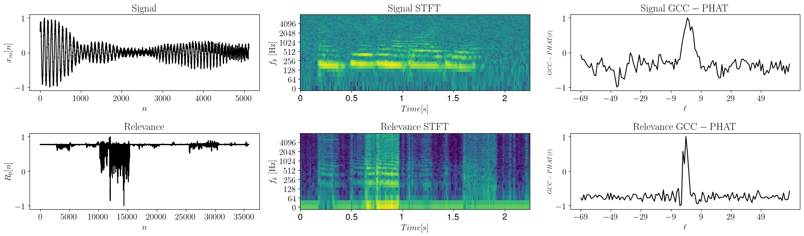
  
Microphone audio signal
<audio controls>
<source src="figures/audio_microphone_sample_cnn_SNR_15_T60_0.4_error_max.wav">
Your browser does not support the audio element.
</audio>

Relevance audio signal
<audio controls>
<source src="figures/audio_relevance_sample_cnn_SNR_15_T60_0.4_error_max.wav" type="audio/mpeg">
Your browser does not support the audio element.
</audio>

#### LocCNN
* #### Best performing
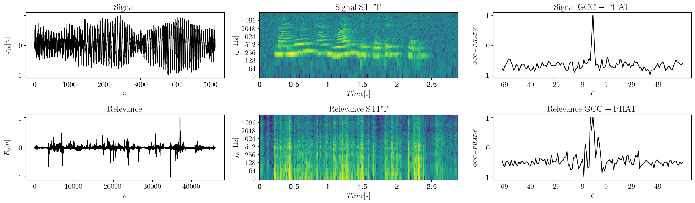

Microphone audio signal
<audio controls>
<source src="figures/audio_microphone_loc_cnn_SNR_15_T60_0.4_error_min.wav">
Your browser does not support the audio element.
</audio>

Relevance audio signal
<audio controls>
<source src="figures/audio_relevance_loc_cnn_SNR_15_T60_0.4_error_min.wav" type="audio/mpeg">
Your browser does not support the audio element.
</audio>

* #### Worst performing
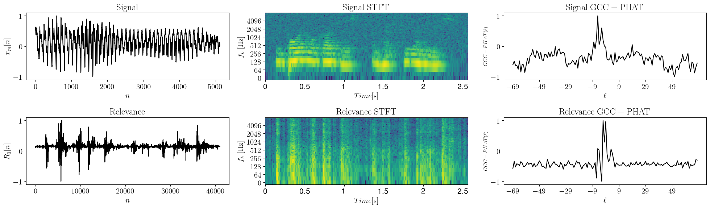
  
Microphone audio signal
<audio controls>
<source src="figures/audio_microphone_loc_cnn_SNR_15_T60_0.4_error_max.wav">
Your browser does not support the audio element.
</audio>

Relevance audio signal
<audio controls>
<source src="figures/audio_relevance_loc_cnn_SNR_15_T60_0.4_error_max.wav" type="audio/mpeg">
Your browser does not support the audio element.
</audio>

## T60 0.6 s SNR 10 dB

#### SampleCNN
* #### Best performing
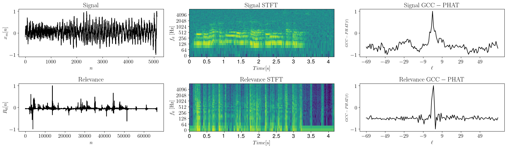

Microphone audio signal
<audio controls>
<source src="figures/audio_microphone_sample_cnn_SNR_10_T60_0.6_error_min.wav">
Your browser does not support the audio element.
</audio>

Relevance audio signal
<audio controls>
<source src="figures/audio_relevance_sample_cnn_SNR_10_T60_0.6_error_min.wav" type="audio/mpeg">
Your browser does not support the audio element.
</audio>

* #### Worst performing
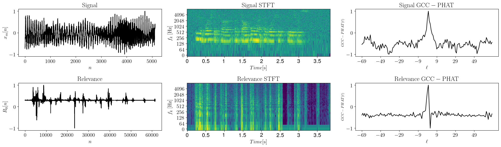
  
Microphone audio signal
<audio controls>
<source src="figures/audio_microphone_sample_cnn_SNR_10_T60_0.6_error_max.wav">
Your browser does not support the audio element.
</audio>

Relevance audio signal
<audio controls>
<source src="figures/audio_relevance_sample_cnn_SNR_10_T60_0.6_error_max.wav" type="audio/mpeg">
Your browser does not support the audio element.
</audio>

#### LocCNN
* #### Best performing
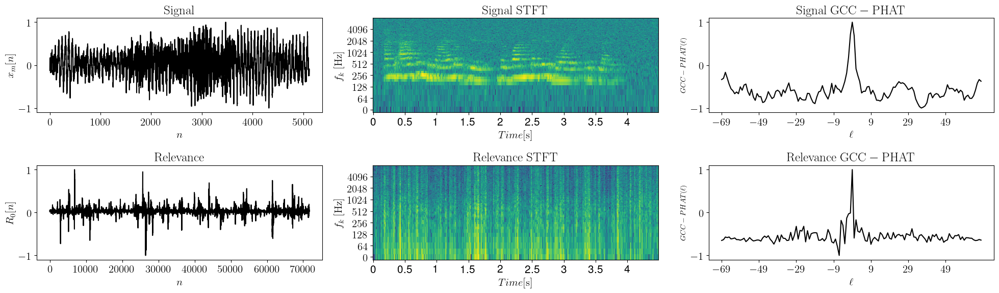

Microphone audio signal
<audio controls>
<source src="figures/audio_microphone_loc_cnn_SNR_10_T60_0.6_error_min.wav">
Your browser does not support the audio element.
</audio>

Relevance audio signal
<audio controls>
<source src="figures/audio_relevance_loc_cnn_SNR_10_T60_0.6_error_min.wav" type="audio/mpeg">
Your browser does not support the audio element.
</audio>

* #### Worst performing
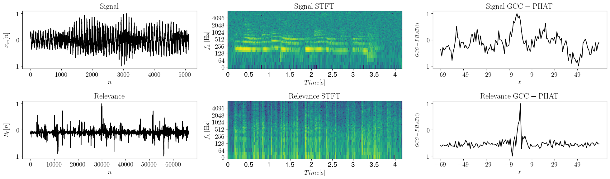
  
Microphone audio signal
<audio controls>
<source src="figures/audio_microphone_loc_cnn_SNR_10_T60_0.6_error_max.wav">
Your browser does not support the audio element.
</audio>

Relevance audio signal
<audio controls>
<source src="figures/audio_relevance_loc_cnn_SNR_10_T60_0.6_error_max.wav" type="audio/mpeg">
Your browser does not support the audio element.
</audio>

